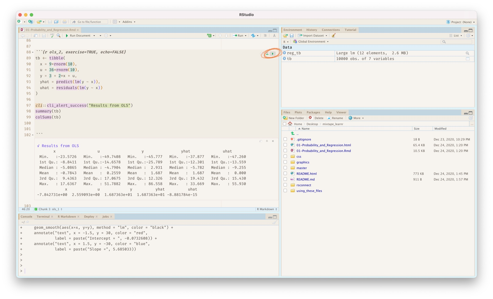

# Teaching Resources for ***Causal Inference**: The Mixtape*

In this repository is a set of R Markdown scripts that follow [Causal Inference: The Mixtape](https://www.amazon.com/dp/0300251688).

## Using these files

First things first, you should fork this repository so you can make changes to the course and customize the files to your liking. To do this, you're in the right place. Click the fork button in the top right corner of this page.

There are three options for how to have students use these materials:

### 1. Run files using Learnr:

### 2. Run files in RStudio:

You can also have students run R Markdown scripts directly from RStudio without using 'Run Document'. RStudio has great support for running code chunks and students would just have to hit the green play button to run each code chunk:

### 3. Run files in the web browser:

The last option allows you to launch the learnr html files directly into a url that students can open on their computer without even having to download R or RStudio. To do so, you will have to have an account with <https://www.shinyapps.io> (run by RStudio) which allows you to create a website and they will run the R Code on their servers. There is a free option that you can use for set up and trying it out, but if you plan on using this for the entire semester, you will probably want to upgrade to the Starter Plan which is \$10/month. This is because your students each will use up hours of compute time and someone needs to pay for the power.

Setting up Online Site:

For each .Rmd file you intend to use, you will have to publish a separate 'project' for this. After you set up you account and forking the repository, you will open your repository in RStudio ([more info on publishing here](<https://rstudio.github.io/learnr/publishing.html>)).

-   Open up the .Rmd file you wish to publish and click File -\> Publish.

-   Select the .Rmd file you wish to publish and the style.css file. Give this an appropriate title and click Publish.

-   This will take a few minutes and may require you to download some R packages, but afterwards it should open up the website in your web-browser. Copy this url.

-   Monitor your compute time usage on shinyapps.io to make sure you don't run out for the month when students are trying to use this!
